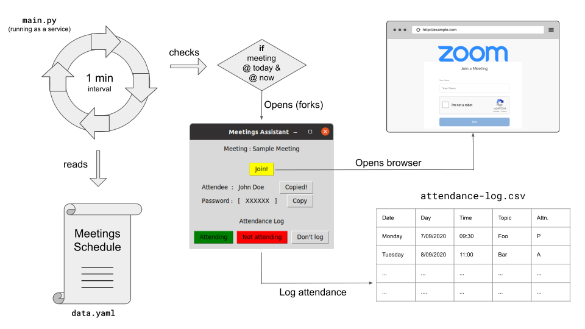

# Meetings assistant

A service that notifies and assist in attending your daily meetings.

OS - linux



## Installation

- Installing python

  ```py
  sudo apt-get install python3-tk
  ```

## Daemonizing

meetings-assistant.service

TODO: Test if we need to cut things

owner mode : `644`

location: `/etc/systemd/system/`

Setup

```bash
cd /path/to/meetings-assistant/
sudo cp ./meetings-assistant.service /etc/systemd/system/.
chmod 644 /etc/systemd/system/meetings-assistant.service
sudo systemctl daemon-reload
sudo systemctl enable meetings-assistant
sudo systemctl start meetings-assistant
```

Check status

```bash
systemctl status meetings-assistant
```

## TODO

- add week days
